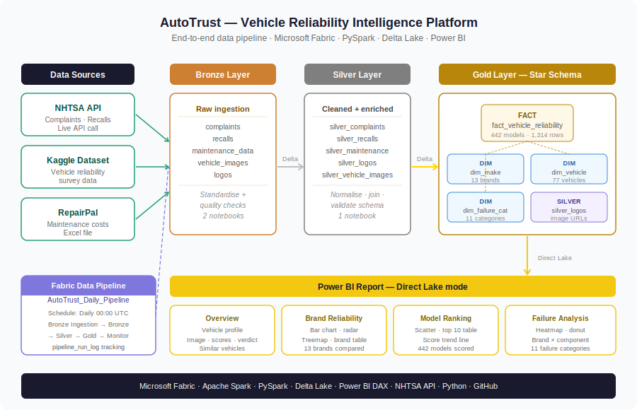

# AutoTrust — Vehicle Reliability Intelligence Platform


> An end-to-end data engineering capstone project that transforms raw vehicle complaint, recall, maintenance, and fuel economy data into actionable reliability intelligence for first-time used car buyers.

---

## 🔗 Live Report

**[View the AutoTrust Power BI Dashboard →](https://app.powerbi.com/groups/fc79ea79-11ab-44fc-8670-6b755ea261d0/reports/c62a5c44-5dc3-412d-bcaa-8a271e82fbc2/b413e89100d0036c5e4c?experience=power-bi)**

---

## 📋 Project Summary

AutoTrust ingests vehicle reliability and fuel economy data from four public sources, processes it through a medallion architecture (Bronze → Silver → Gold) on Microsoft Fabric, and surfaces composite reliability and total cost of ownership scores through an interactive Power BI report.

The platform is designed to answer one question for a first-time used car buyer:

> **"Which vehicle should I buy, and what will it truly cost me to run it?"**

### Key outputs
- Composite reliability scores for 1,314 vehicle model/year combinations across 25 brands
- Fuel economy data (city, highway, combined MPG + annual fuel cost) for 1,236 vehicles via EPA API
- Total annual running cost = repair cost + fuel cost per vehicle
- Component-level failure analysis across 11 failure categories
- 5-year estimated total running cost comparisons
- Personalised vehicle recommendations filtered by budget
- Vehicle profile page with image, scores, fuel efficiency, verdict, and similar alternatives

---

## 🏗️ Architecture



### Pipeline flow

```
NHTSA API ─────────────────────┐
Kaggle Dataset ─────────────── ├──▶ Bronze ──▶ Silver ──▶ Gold ──▶ Power BI
RepairPal Excel ───────────────┘                    ▲
EPA Fuel Economy API ──────────────────────────────┘
```

| Layer | Tables | Notebooks |
|---|---|---|
| Bronze | complaints, recalls, maintenance_data, vehicle_images, logos, bronze_fuel_economy | 01_Bronze_Ingestion, 02_Bronze_Standardization, 06_Bronze_Fuel_Economy |
| Silver | silver_complaints, silver_recalls, silver_maintenance_data, silver_logos, silver_vehicle_images, silver_fuel_economy | 03_Silver_Transformation, 07_Silver_Fuel_Economy |
| Gold | gold_dim_make, gold_dim_vehicle, gold_dim_failure_category, gold_fact_vehicle_reliability | 04_Gold_Build, 08_Gold_Fuel_Economy |

---

## 📊 Dashboard Pages

| Page | Description | Key Visual |
|---|---|---|
| Overview | Vehicle profile — select make/model/year to see image, scores, fuel efficiency, verdict, similar vehicles | Vehicle image + score breakdown + verdict |
| Brand Reliability | Compare all 25 brands by reliability score | Horizontal bar chart + bullet chart scorecard |
| Model Ranking | Scatter plot of reliability vs annual cost per model | Scatter plot + top 10 table |
| Failure Analysis | Brand × component heatmap showing where each brand fails | Matrix heatmap |
| Buyer Recommendations | Budget-filtered top picks + vehicles to avoid | Top picks table + 5-year stacked cost chart |

---

## 📸 Screenshots

| Overview | Brand Reliability |
|---|---|
|  |  |

| Model Ranking | Failure Analysis |
|---|---|
|  |  |

| Buyer Recommendations | Pipeline Canvas |
|---|---|
|  |  |

---

## 🗄️ Data Sources

| Source | Type | Data |
|---|---|---|
| [NHTSA API](https://api.nhtsa.gov/) | REST API (live) | Vehicle complaints and safety recalls |
| [Kaggle](https://www.kaggle.com/) | CSV download | Owner reliability ratings and survey data |
| RepairPal | Excel file | Annual maintenance costs and repair frequency |
| [EPA Fuel Economy API](https://fueleconomy.gov/feg/ws/) | REST API (live) | City/highway/combined MPG and annual fuel cost estimates |

---

## ⚙️ Tech Stack

| Tool | Purpose |
|---|---|
| Microsoft Fabric | Lakehouse, Data Pipelines, workspace orchestration |
| Apache Spark / PySpark | Data transformation and aggregation |
| Delta Lake | Storage format for all medallion layers |
| Power BI (Direct Lake) | Interactive reporting and DAX measures |
| NHTSA API | Live vehicle complaints and recall data |
| EPA Fuel Economy API | Live fuel economy and annual cost estimates |
| Python | Ingestion scripts, API calls, image URL processing |
| GitHub | Version control and portfolio hosting |

---

## 📁 Repository Structure

```
autotrust-vehicle-reliability/
│
├── notebooks/
│   ├── 01_Bronze_Ingestion.ipynb        # NHTSA API + Kaggle + RepairPal ingestion
│   ├── 02_Bronze_Standardization.ipynb  # Standardisation + quality checks
│   ├── 03_Silver_Transformation.ipynb   # Cleaning + enrichment + silver tables
│   ├── 04_Gold_Build.ipynb              # Dims + fact table + scoring logic
│   ├── 05_Pipeline_Monitor.ipynb        # Run log validation + row count checks
│   ├── 06_Bronze_Fuel_Economy.ipynb     # EPA API ingestion (incremental fetch)
│   ├── 07_Silver_Fuel_Economy.ipynb     # Fuel data cleaning + efficiency tiers
│   └── 08_Gold_Fuel_Economy.ipynb       # Fuel join + total cost + score rebuild
│
├── docs/
│   └── architecture.svg                 # End-to-end pipeline architecture diagram
│
├── screenshots/
│   ├── overview.png                     # Vehicle profile page
│   ├── brand_reliability.png            # Brand reliability page
│   ├── model_ranking.png                # Model ranking page
│   ├── failure_analysis.png             # Failure analysis page
│   ├── buyer_recommendations.png        # Buyer recommendations page
│   └── pipeline.png                     # Fabric pipeline canvas
│
└── README.md
```

---

## 🔄 Data Pipeline

The project includes a fully automated Fabric Data Pipeline (`AutoTrust_Daily_Pipeline`) that runs on a daily schedule at 00:00 UTC.

### Pipeline canvas


### Execution flow

```
[Schedule: Daily 00:00 UTC]
        │
        ▼
[Bronze Ingestion]          ← Live NHTSA API + Kaggle + RepairPal (~22 min)
        │ Completion
        ▼
[Bronze Standardization]    ← Quality checks + schema standardisation (~1 min)
        │ Completion
        ▼
[Silver Transformation]     ← Cleaning + enrichment + silver_* tables (~1 min)
        │ Completion
        ▼
[Gold Build]                ← Scoring + dim/fact table construction (~4 min)
        │ Completion
        ▼
[Bronze Fuel Economy]       ← EPA API — incremental fetch (new vehicles only)
        │ Completion        ← ~30s on normal runs · ~38 min on full refresh
        ▼
[Silver Fuel Economy]       ← Fuel cleaning + efficiency tier classification (~1 min)
        │ Completion
        ▼
[Gold Fuel Economy]         ← Fuel join + total cost + recommendation score rebuild (~1 min)
        │ Completion
        ▼
[Pipeline Monitor]          ← Run log validation + gold table row counts (~34s)
```

**Typical pipeline runtime: ~30 minutes**
**Full refresh runtime (including EPA): ~70 minutes**

All activities use **Completion** dependency — the pipeline continues even if a stage encounters an error, ensuring partial refreshes rather than full blackouts.

### Incremental fuel fetch

`Bronze_Fuel_Economy` uses incremental logic — it compares the existing `bronze_fuel_economy` table against `gold_fact_vehicle_reliability` and only fetches EPA data for new vehicles. On a typical daily run with no new vehicles this stage completes in under 30 seconds. Set `force_full_refresh = True` in the notebook to re-fetch all vehicles.

### Pipeline observability

Each notebook appends a run record to `pipeline_run_log` on every execution:

```
+----------------------+--------------------------+--------------------------+-------------+-------+
|notebook_name         |run_start                 |run_end                   |duration_secs|status |
+----------------------+--------------------------+--------------------------+-------------+-------+
|Bronze_ingestion      |2026-04-24 03:59:52.722453|2026-04-24 04:21:26.801421|1294         |SUCCESS|
|Bronze                |2026-04-24 04:22:28.164605|2026-04-24 04:23:33.711988|65           |SUCCESS|
|Silver                |2026-04-24 04:24:17.345865|2026-04-24 04:25:29.251418|71           |SUCCESS|
|Gold                  |2026-04-24 04:26:49.889146|2026-04-24 04:30:26.307799|216          |SUCCESS|
|Bronze_Fuel_Economy   |2026-04-24 04:31:00.000000|2026-04-24 04:31:28.000000|28           |SUCCESS|
|Silver_Fuel_Economy   |2026-04-24 04:32:00.000000|2026-04-24 04:32:45.000000|45           |SUCCESS|
|Gold_Fuel_Economy     |2026-04-24 04:33:00.000000|2026-04-24 04:33:52.000000|52           |SUCCESS|
|Pipeline_Monitor      |2026-04-24 04:34:10.360913|2026-04-24 04:34:45.031358|34           |SUCCESS|
+----------------------+--------------------------+--------------------------+-------------+-------+
```

### Gold table row counts (post-run)

| Table | Rows | Description |
|---|---|---|
| gold_dim_make | 27 | Brand-level reliability scores |
| gold_dim_vehicle | 77 | Vehicle images and identifiers |
| gold_dim_failure_category | 275 | Brand × component failure counts |
| gold_fact_vehicle_reliability | 1,314 | Model + year scores, costs, fuel economy |
| silver_fuel_economy | 1,236 | Cleaned EPA fuel data (94% coverage) |

---

## 📐 Data Model

The Gold layer follows a star schema:

```
gold_dim_make (25 brands)
      │
      │ 1:many
      ▼
gold_fact_vehicle_reliability (1,314 rows) ◄── gold_dim_vehicle (77 vehicles)
      │
      │ includes fuel economy columns joined from silver_fuel_economy
      │ city_mpg · highway_mpg · combined_mpg · annual_fuel_cost
      │ fuel_type · fuel_category · is_electric · efficiency_tier
      │ total_annual_cost · norm_total_cost
      │
      └──── gold_dim_failure_category (275 rows)
```

### Scoring logic

**Reliability score** — composite of normalised complaint rate, recall rate, and repair cost:

```python
reliability_score = (
    (1 - complaints_norm) * 0.5 +
    (1 - recalls_norm)    * 0.3 +
    (1 - cost_norm)       * 0.2
) * 100
```

**Recommendation score** — weights reliability, repair cost, and total running cost (repair + fuel):

```python
recommendation_score = (
    reliability_score          * 0.6 +
    (1 - norm_repair_cost) * 100 * 0.2 +
    (1 - norm_total_cost)  * 100 * 0.2
)
```

### Fuel efficiency tiers

| Tier | Combined MPG | Example vehicles |
|---|---|---|
| Excellent | ≥ 40 MPG | Toyota Prius, Hyundai Ioniq 6, Tesla Model 3 |
| Good | 30–39 MPG | Honda Civic, Toyota Corolla, Mazda CX-30 |
| Average | 22–29 MPG | Toyota Camry, Honda CR-V, Subaru Outback |
| Below Average | 15–21 MPG | BMW X5 M, Jeep Wrangler, Ford F-150 |
| Poor | < 15 MPG | BMW M5, Dodge Challenger, high-performance models |

---

## 🚀 Getting Started

### Prerequisites
- Microsoft Fabric workspace with Lakehouse
- Power BI Desktop (for local report editing)
- Python 3.8+

### Run the pipeline manually

1. Open your Fabric workspace
2. Run notebooks in order:
   ```
   01_Bronze_Ingestion
   02_Bronze_Standardization
   03_Silver_Transformation
   04_Gold_Build
   06_Bronze_Fuel_Economy
   07_Silver_Fuel_Economy
   08_Gold_Fuel_Economy
   ```
3. Open Power BI Desktop → refresh the semantic model
4. Publish to Power BI Service

### Force a full EPA fuel refresh

Open `06_Bronze_Fuel_Economy` and set:
```python
force_full_refresh = True
```
Then run the notebook manually. This re-fetches all 1,314 vehicles from the EPA API (~38 minutes).

### Monitor pipeline runs

```python
from pyspark.sql.functions import col
from datetime import datetime

today = datetime.utcnow().date()

spark.read.format("delta").load("Tables/pipeline_run_log") \
    .filter(col("run_start").cast("date") == str(today)) \
    .orderBy("run_start") \
    .show(10, truncate=False)
```

### Scheduled refresh
The `AutoTrust_Daily_Pipeline` runs automatically at 00:00 UTC daily and refreshes all Gold tables end to end.

---

## 👤 Author

**Pius** — [@Og-Kojo](https://github.com/Og-Kojo)

---

## 📄 License

This project is licensed under the MIT License — see the [LICENSE](LICENSE) file for details.

---

## 🙏 Acknowledgements

- [NHTSA](https://www.nhtsa.gov/) for providing open vehicle safety data via public API
- [Kaggle](https://www.kaggle.com/) for the vehicle reliability dataset
- [RepairPal](https://repairpal.com/) for maintenance cost data
- [EPA](https://www.fueleconomy.gov/) for the fuel economy API
- Microsoft Fabric and Power BI teams for the platform tooling
