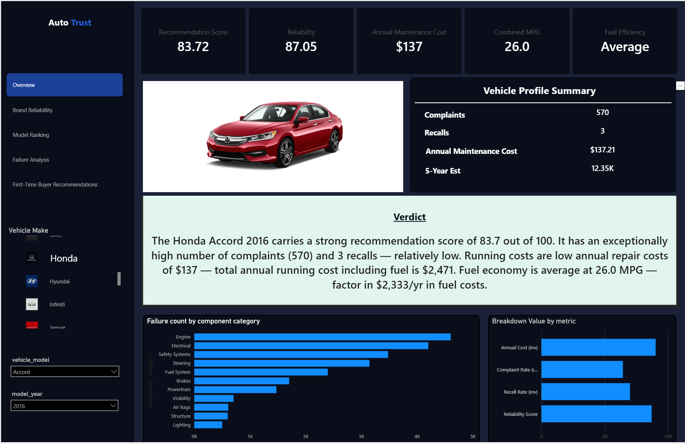
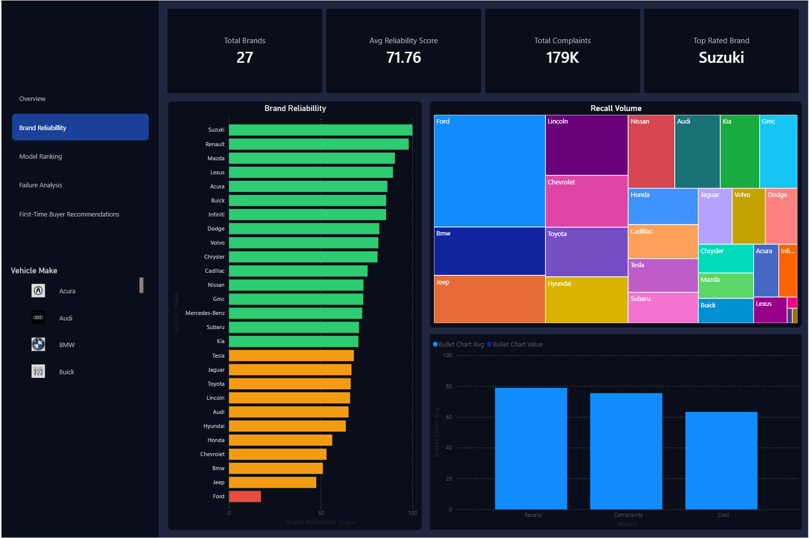
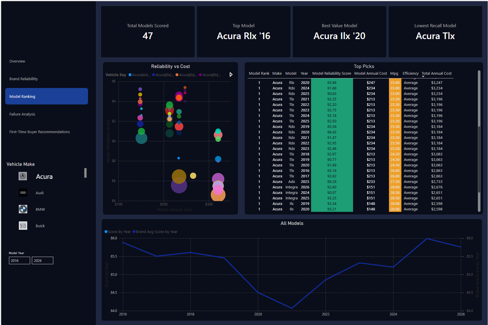
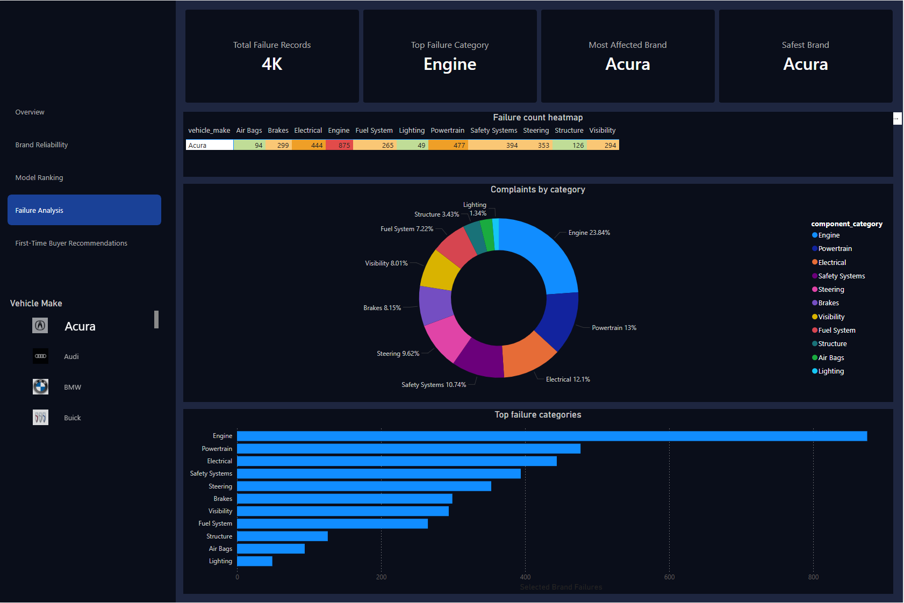
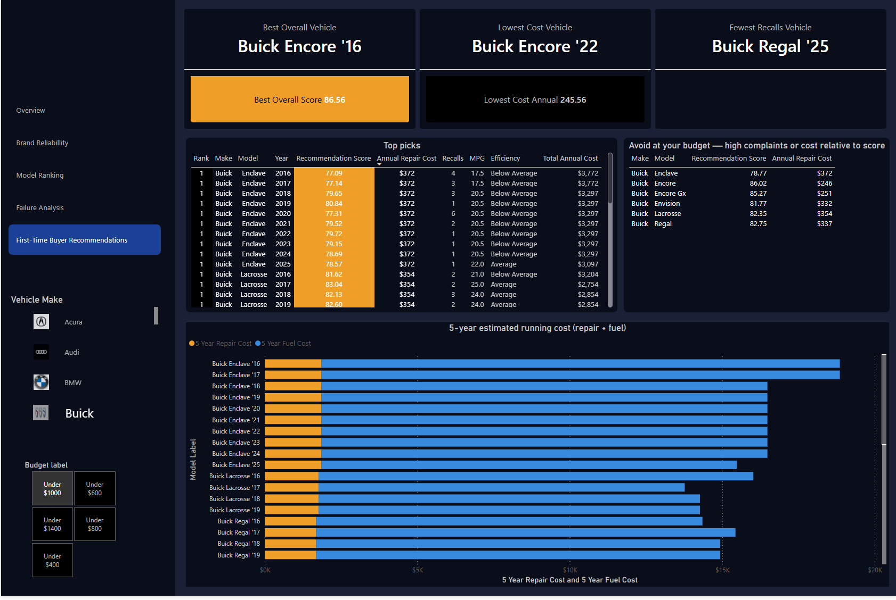
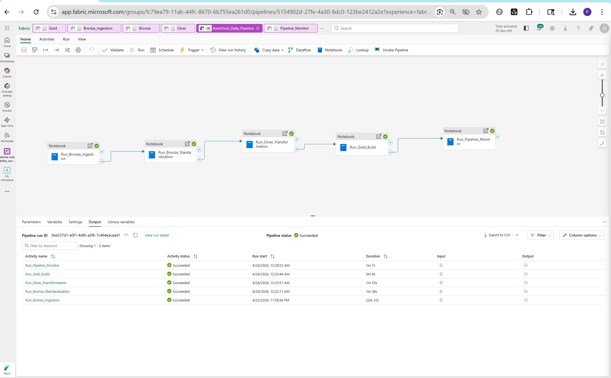

# autotrust-vehicle-reliability
End-to-end vehicle reliability intelligence platform built on Microsoft Fabric · PySpark · Delta Lake · Power BI
# AutoTrust — Vehicle Reliability Intelligence Platform


> An end-to-end data engineering capstone project that transforms raw vehicle complaint, recall, and maintenance data into actionable reliability intelligence for first-time used car buyers.

---

## 🔗 Live Report

**[View the AutoTrust Power BI Dashboard →](https://app.powerbi.com/view?r=eyJrIjoiOGI1ZDMzMDMtNDY5My00ZWNkLWFmNWYtMzE1ZmNkMzIyYWY4IiwidCI6IjAxZDA3YzY1LTM2OTMtNGZhZi1hNGUyLTM5YTA5MzY3NmE4OCJ9)**

---

## 📋 Project Summary

AutoTrust ingests vehicle reliability data from three public sources, processes it through a medallion architecture (Bronze → Silver → Gold) on Microsoft Fabric, and surfaces composite reliability scores through an interactive Power BI report.

The platform is designed to answer one question for a first-time used car buyer:

> **"Which vehicle should I buy, and what will it cost me to run it?"**

### Key outputs
- Composite reliability scores for 442 vehicle models across 13 brands
- Component-level failure analysis across 11 failure categories
- 5-year estimated repair cost comparisons
- Personalised vehicle recommendations filtered by budget
- Vehicle profile page with image, scores, verdict, and similar alternatives

---

## 🏗️ Architecture


### Pipeline flow

```
NHTSA API ─────────────────────┐
Kaggle Dataset ─────────────── ├──▶ Bronze ──▶ Silver ──▶ Gold ──▶ Power BI
RepairPal Excel ───────────────┘
```

| Layer | Tables | Notebooks |
|---|---|---|
| Bronze | complaints, recalls, maintenance_data, vehicle_images, logos | 01_Bronze_Ingestion, 02_Bronze_Standardization |
| Silver | silver_complaints, silver_recalls, silver_maintenance_data, silver_logos, silver_vehicle_images | 03_Silver_Transformation |
| Gold | gold_dim_make, gold_dim_vehicle, gold_dim_failure_category, gold_fact_vehicle_reliability | 04_Gold_Build |

---

## 📊 Dashboard Pages

| Page | Description | Key Visual |
|---|---|---|
| Overview | Vehicle profile — select make/model/year to see image, scores, verdict, similar vehicles | Vehicle image + score breakdown |
| Brand Reliability | Compare all 13 brands by reliability score | Horizontal bar chart + radar |
| Model Ranking | Scatter plot of reliability vs annual cost per model | Scatter plot + top 10 table |
| Failure Analysis | Brand × component heatmap showing where each brand fails | Matrix heatmap |
| Buyer Recommendations | Budget-filtered top picks + vehicles to avoid | Top picks table + cost comparison |

---

## 📸 Screenshots

| Overview | Brand Reliability |
|---|---|
|  |  |

| Model Ranking | Failure Analysis |
|---|---|
|  |  |

| Buyer Recommendations | Pipeline Canvas |
|---|---|
|  |  |

---

## 🗄️ Data Sources

| Source | Type | Data |
|---|---|---|
| [NHTSA API](https://api.nhtsa.gov/) | REST API (live) | Vehicle complaints and safety recalls |
| [Kaggle](https://www.kaggle.com/) | CSV download | Owner reliability ratings and survey data |
| RepairPal | Excel file | Annual maintenance costs and repair frequency |

---

## ⚙️ Tech Stack

| Tool | Purpose |
|---|---|
| Microsoft Fabric | Lakehouse, Data Pipelines, workspace orchestration |
| Apache Spark / PySpark | Data transformation and aggregation |
| Delta Lake | Storage format for all medallion layers |
| Power BI (Direct Lake) | Interactive reporting and DAX measures |
| Python | Ingestion scripts, API calls, image URL processing |
| GitHub | Version control and portfolio hosting |

---

## 📁 Repository Structure

```
autotrust-vehicle-reliability/
│
├── notebooks/
│   ├── 01_Bronze_Ingestion.ipynb        # NHTSA API + Kaggle + RepairPal ingestion
│   ├── 02_Bronze_Standardization.ipynb  # Standardisation + quality checks
│   ├── 03_Silver_Transformation.ipynb   # Cleaning + enrichment + silver tables
│   ├── 04_Gold_Build.ipynb              # Dims + fact table + scoring logic
│   └── 05_Pipeline_Monitor.ipynb        # Run log validation + row count checks
│
├── docs/
│   └── architecture.svg                 # End-to-end pipeline architecture diagram
│
├── screenshots/
│   ├── overview.png                     # Vehicle profile page
│   ├── brand_reliability.png            # Brand reliability page
│   ├── model_ranking.png                # Model ranking page
│   ├── failure_analysis.png             # Failure analysis page
│   ├── buyer_recommendations.png        # Buyer recommendations page
│   └── pipeline.png                     # Fabric pipeline canvas
│
└── README.md
```

---

##  Data Pipeline

The project includes a fully automated Fabric Data Pipeline (`AutoTrust_Daily_Pipeline`) that runs on a daily schedule at 00:00 UTC.

### Pipeline canvas


### Execution flow

```
[Schedule: Daily 00:00 UTC]
        │
        ▼
[Bronze Ingestion]        ← Live NHTSA API call + static source reads (~22 min)
        │ Completion
        ▼
[Bronze Standardization]  ← Quality checks + schema standardisation (~1 min)
        │ Completion
        ▼
[Silver Transformation]   ← Cleaning + enrichment + silver_* tables (~1 min)
        │ Completion
        ▼
[Gold Build]              ← Scoring + dim/fact table construction (~4 min)
        │ Completion
        ▼
[Pipeline Monitor]        ← Run log validation + gold table row counts (~34s)
```

**Total pipeline runtime: ~30 minutes**

All activities use **Completion** dependency — the pipeline continues even if a stage encounters an error, ensuring partial refreshes rather than full blackouts.

### Pipeline observability

Each notebook appends a run record to `pipeline_run_log` on every execution:

```
+----------------+--------------------------+--------------------------+-------------+-------+
|notebook_name   |run_start                 |run_end                   |duration_secs|status |
+----------------+--------------------------+--------------------------+-------------+-------+
|Bronze_ingestion|2026-04-24 03:59:52.722453|2026-04-24 04:21:26.801421|1294         |SUCCESS|
|Bronze          |2026-04-24 04:22:28.164605|2026-04-24 04:23:33.711988|65           |SUCCESS|
|Silver          |2026-04-24 04:24:17.345865|2026-04-24 04:25:29.251418|71           |SUCCESS|
|Gold            |2026-04-24 04:26:49.889146|2026-04-24 04:30:26.307799|216          |SUCCESS|
|Pipeline_Monitor|2026-04-24 04:29:10.360913|2026-04-24 04:29:45.031358|34           |SUCCESS|
+----------------+--------------------------+--------------------------+-------------+-------+
```

### Gold table row counts (post-run)

| Table | Rows | Description |
|---|---|---|
| gold_dim_make | 27 | Brand-level reliability scores |
| gold_dim_vehicle | 77 | Vehicle images and identifiers |
| gold_dim_failure_category | 275 | Brand × component failure counts |
| gold_fact_vehicle_reliability | 1,314 | Model + year level scores and costs |

---

##  Data Model

The Gold layer follows a star schema:

```
gold_dim_make (27 brands)
      │
      │ 1:many
      ▼
gold_fact_vehicle_reliability (1,314 rows) ◄── gold_dim_vehicle (77 vehicles)
                                    │
                                    └──── gold_dim_failure_category (275 rows)
```

### Scoring logic

**Reliability score** — composite of normalised complaint rate, recall rate, and repair cost:

```python
reliability_score = (
    (1 - complaints_norm) * 0.5 +
    (1 - recalls_norm)    * 0.3 +
    (1 - cost_norm)       * 0.2
) * 100
```

**Recommendation score** — weights reliability against annual ownership cost:

```python
recommendation_score = reliability_score * 0.7 + (100 - norm_cost * 100) * 0.3
```

---

##  Getting Started

### Prerequisites
- Microsoft Fabric workspace with Lakehouse
- Power BI Desktop (for local report editing)
- Python 3.8+

### Run the pipeline manually

1. Open your Fabric workspace
2. Run notebooks in order:
   ```
   01_Bronze_Ingestion → 02_Bronze_Standardization → 03_Silver_Transformation → 04_Gold_Build
   ```
3. Open Power BI Desktop → refresh the semantic model
4. Publish to Power BI Service

### Monitor pipeline runs

```python
from pyspark.sql.functions import col
from datetime import datetime

today = datetime.utcnow().date()

spark.read.format("delta").load("Tables/dbo/pipeline_run_log") \
    .filter(col("run_start").cast("date") == str(today)) \
    .orderBy("run_start") \
    .show(10, truncate=False)
```

### Scheduled refresh
The `AutoTrust_Daily_Pipeline` runs automatically at 00:00 UTC daily and refreshes all Gold tables end to end.

---

## 👤 Author

**Pius** — [@Og-Kojo](https://github.com/Og-Kojo)

---

## 📄 License

This project is licensed under the MIT License — see the [LICENSE](LICENSE) file for details.

---

##  Acknowledgements

- [NHTSA](https://www.nhtsa.gov/) for providing open vehicle safety data via public API
- [Kaggle](https://www.kaggle.com/) for the vehicle reliability dataset
- [RepairPal](https://repairpal.com/) for maintenance cost data
- Microsoft Fabric and Power BI teams for the platform tooling
